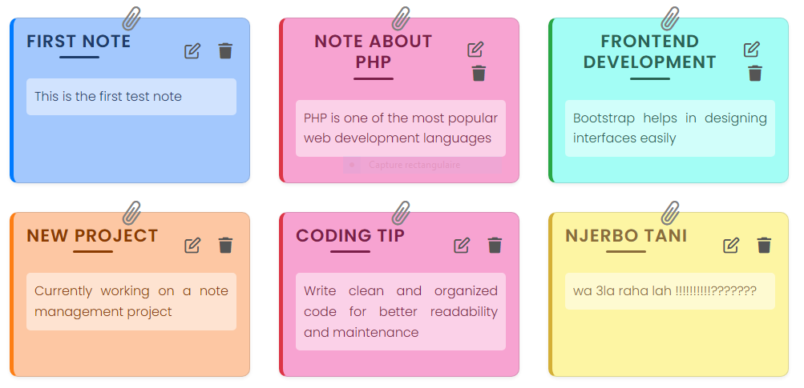
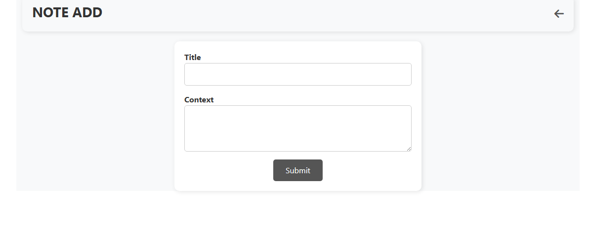
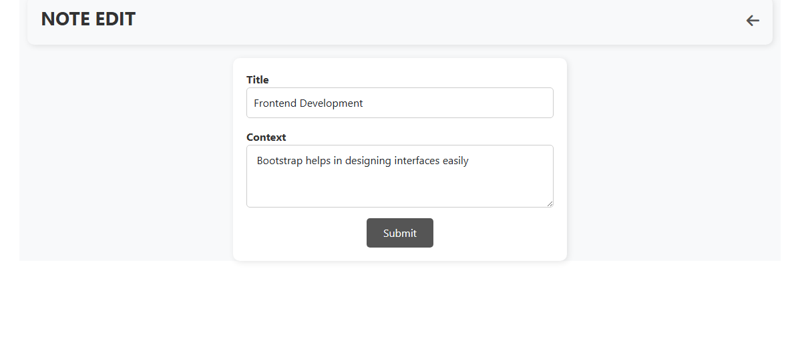
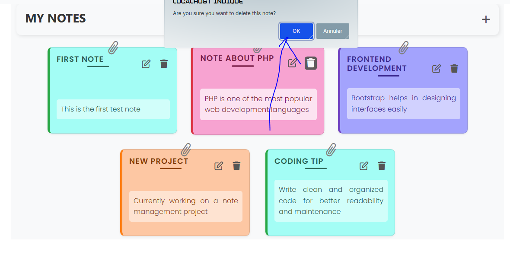

# 📝 Simple Notes App

A sleek and interactive **notes management application** with a modern design and easy-to-use interface. This project is perfect for organizing, adding, editing, and deleting notes efficiently. Enjoy a clean, flat-design look that adapts beautifully to any screen size!

---

## 🌟 Default View

Below are some screenshots of the **Simple Notes App** in action:

| Notes List                                   | Add Note                                   | Edit Note                                   | Delete Confirmation                                   |
|----------------------------------------------|---------------------------------------------|---------------------------------------------|---------------------------------------------|
|  |  |  |  |

---

## 💻 Tech Stack

This project is built using the following technologies:


---

## 🚀 How to Use

Follow the steps below to get started with the **Simple Notes App**:

1. **Clone the repository:**
   ```bash
   git clone https://github.com/Rochdi7/php/simple-notes-app.git
   ```

2. **Navigate to the project directory:**
   ```bash
   cd simple-notes-app
   ```

3. **Run the project on a local server** (e.g., XAMPP, WAMP, or built-in PHP server):
   ```bash
   php -S localhost:8000
   ```

4. **Open `index.php` in your browser** to start managing notes.

---

## 📜 Features

- **Modern UI:**  
  Clean, minimalistic design for ease of use.
- **CRUD Functionality:**  
  Create, Read, Update, and Delete notes effortlessly.
- **Responsive Layout:**  
  Works seamlessly on all devices.
- **User-Friendly Interface:**  
  Simple form handling with visual feedback.

---

## ✨ Future Improvements

- **Search & Filter:**  
  Allow users to quickly find notes.
- **Categories & Tags:**  
  Organize notes more effectively.
- **Autosave Feature:**  
  Prevent accidental data loss.
- **Dark Mode Support:**  
  Improve accessibility for all users.

---

## 🤝 Contributing

Contributions are always welcome! If you’d like to improve this project, follow these steps:

1. **Fork the repository.**
2. **Create a new branch** for your feature or bug fix:
   ```bash
   git checkout -b feature/your-feature-name
   ```
3. **Commit your changes**:
   ```bash
   git commit -m "Add some feature"
   ```
4. **Push to your branch**:
   ```bash
   git push origin feature/your-feature-name
   ```
5. **Open a pull request** on GitHub.

---

## 📢 License

This project is licensed under the **MIT License** - see the [LICENSE](LICENSE) file for details.

---

## 📬 Contact

For any inquiries or feedback, feel free to reach out:


- **Email:** rochdi.karouali1234@gmail.com
- **GitHub:** [@Rochdi7](https://github.com/Rochdi7)

---

## ⭐ Support

If you enjoy this project, please give it a star on GitHub! Your support inspires me to create more awesome projects. Happy coding! 🚀

---

Enjoy your Simple Notes App!
